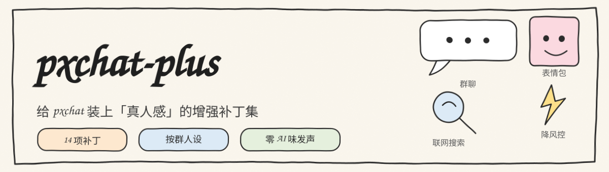
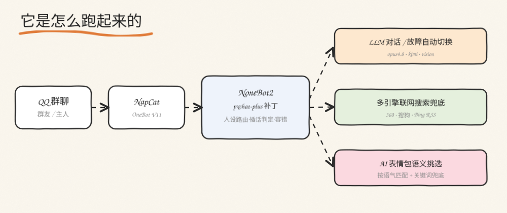

<div align="center">



[](https://www.python.org/)
[](https://v2.nonebot.dev/)
[](./LICENSE)

针对 `nonebot-plugin-pxchat` 的一组构建期补丁：修复若干稳定性问题，并补充按群参与概率、按群独立人设等能力。

</div>

---

## 背景

[`nonebot-plugin-pxchat`](https://github.com/whopxxx/nonebot-plugin-pxchat) 通过 pip 安装，迭代较快。直接 fork 容易产生长期冲突，且从 PyPI 安装时用户无法直接改动源码。

本项目采用**补丁脚本**方案：在镜像构建或部署阶段，对已安装包做精确的字符串替换。所有替换都基于精确匹配并带 `assert`，一旦上游结构变化会立即报错，而不是静默产生错误行为。这样既能跟随上游升级，又能把改动控制在一个可审计的脚本里。

---

## 工作原理

<div align="center">

</div>

pxchat 的消息处理链路大致为：

```
OneBot 适配器 → on_message 匹配器 → 读取上下文
        → 群聊参与判定(should_reply_in_group)
        → 模型调用(get_chat_reply_with_tools)
        → 分段发送(send_split_messages) → 适配器发送
```

补丁分布在这条链路的关键节点上：调用超时与重试、并发控制、群聊参与判定、模型故障切换、搜索兜底、表情包语义挑选、发送限速，以及输出解析的容错。

---

## 补丁清单

| 类别 | 补丁 | 目标文件 | 说明 |
|---|---|---|---|
| 稳定性 | 超时与重试 | `chat.py` | 为 `AsyncOpenAI` 客户端增加 `timeout` 与 `max_retries` |
| 稳定性 | 并发限制 | `__init__.py` | 以 `asyncio.Semaphore` 限制同时进行的模型请求 |
| 稳定性 | 模型故障自动切换 | `chat.py` | 主模型调用失败时按顺序尝试备用配置 |
| 稳定性 | 输出容错解析 | `__init__.py`、`chat.py` | 兼容纯文本与 ```json 围栏，解析失败不再误报异常 |
| 稳定性 | 全局发送限速 | `__init__.py` | 相邻消息至少间隔 2 秒，降低触发风控的概率 |
| 行为 | 群活跃度冷启动修复 | `__init__.py` | 未命中活跃度状态时回退基础概率，修复“设了概率不回复” |
| 行为 | 主动插话冷却 | `__init__.py` | 单群两次主动发言至少间隔 N 秒，避免连续刷屏 |
| 行为 | 按群独立人设 | `chat.py`、`manager.py` | `get_system_prompt` 支持 `group_id`，按群读取人设 |
| 信息 | 多引擎搜索兜底 | `chat.py` | 触发关键词时调用 360 / 搜狗 / Bing RSS 预搜索 |
| 信息 | 提示词注入当前时间 | `chat.py` | 减少“今天/现在”类时间幻觉 |
| 表现 | 表情包语义挑选 | `__init__.py` | 依据回复语气用模型挑选表情包，失败回退关键词匹配 |
| 表现 | 图片识别优化 | `image2txt.py` | 先下载转 base64，避免上游拉取外链失败；单条消息只识别一张 |

---

## 使用

### Dockerfile 构建期打补丁（推荐）

```dockerfile
COPY patch_pxchat.py ./
COPY patch_pxchat_fixes.py ./
COPY apply_pergroup.py ./
RUN python patch_pxchat.py \
 && python apply_pergroup.py \
 && python patch_pxchat_fixes.py
```

### 容器内热补丁

```bash
docker cp patches/patch_pxchat.py       <container>:/tmp/
docker cp patches/patch_pxchat_fixes.py <container>:/tmp/
docker exec <container> python3 /tmp/patch_pxchat.py
docker exec <container> python3 /tmp/patch_pxchat_fixes.py
docker restart <container>
```

补丁脚本是幂等的：对已经打过补丁的文件重复执行会跳过。

---

## 按群人设配置

在 pxchat 的 `px_chat_manager.json` 中新增 `group_personalities` 字段：

```jsonc
{
  "group_personalities": {
    "1043251659": "群 1 的独立人设……",
    "559499709":  "群 2 的独立人设……"
  },
  "group_probabilities": {
    "1043251659": 1.0,
    "559499709": 0.95
  }
}
```

`get_system_prompt(is_group, group_id)` 优先读取该群人设，缺省回退到全局 `personality`。

---

## 设计说明

**为什么用补丁而不是 fork**：pxchat 从 PyPI 安装，fork 需要用户改用源码安装，且上游一旦改动就会产生合并冲突。补丁脚本把差异集中、可审计，断言保证“上游变了就报错”。

**容错解析**：模型不一定严格遵守 `response_format=json_object`，会返回纯文本或带代码围栏的 JSON。解析逻辑先尝试标准 JSON，再尝试去除围栏，都失败则把原文作为单条消息发送，避免丢消息。

**活跃度模型**：每个群维护一个随时间衰减的活跃度值，被 @ 或主动参与后“续租”到基础概率。原始实现对未激活的群直接返回 0，导致基础概率不生效；补丁改为回退基础概率。

---

## 兼容性

| 依赖 | 版本 |
|---|---|
| Python | 3.10+ |
| NoneBot2 | 2.4+ |
| nonebot-plugin-pxchat | 1.0.x |
| nonebot-adapter-onebot | 2.4+ |

补丁基于字符串精确匹配，pxchat 大版本升级后可能需要同步更新匹配目标。

---

## 目录结构

```
nonebot-plugin-pxchat-plus/
├── patches/
│   ├── patch_pxchat.py        # 主补丁：超时/并发/搜索/表情包/限速/模型切换
│   ├── patch_pxchat_fixes.py  # 容错解析补丁（幂等）
│   └── apply_pergroup.py      # 按群参与概率补丁（幂等）
├── examples/
│   ├── Dockerfile.example
│   └── docker-compose.example.yml
├── docs/
│   ├── features.md
│   ├── group-behavior.md
│   └── persona-guide.md
└── scripts/
    └── install.sh
```

---

## 限制

- 补丁针对特定版本的 pxchat，上游大改后需同步。
- 多引擎搜索依赖公网可达，离线环境自动降级。
- 表情包语义挑选依赖一个可用的对话模型，失败时回退关键词匹配。

## License

[MIT](./LICENSE)
